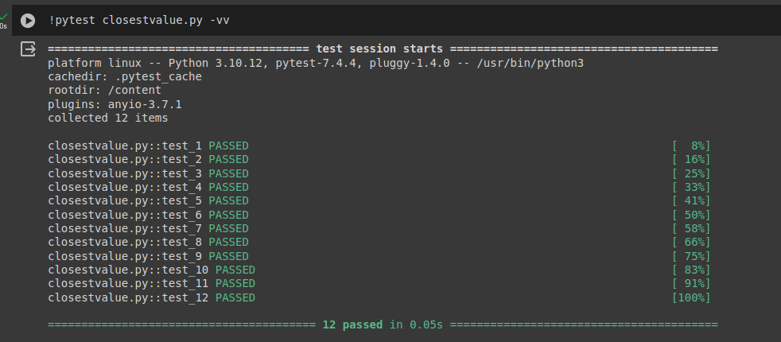
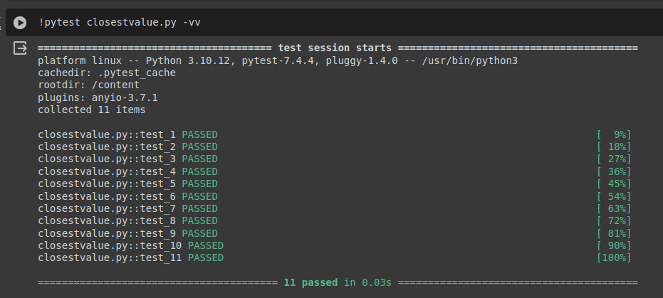

# Complexity of different operations in Binary Search Tree

Student: João Pedro Freire Cabral


Repo: https://github.com/jpfcabral/bst-challenges


In a Binary Search Tree (BST), the efficiency of operations varies based on the structure of the tree. Searching, insertion, and deletion typically achieve O(h) time complexity, where h represents the height of the tree. However, the efficiency of these operations can degrade to O(n) in unbalanced trees. Careful balancing ensures optimal performance for all operations in a BST.

## Challenge 1 - Find Closest Value in BST


The problem of finding the closest value in a Binary Search Tree (BST) involves identifying the node in the tree whose value is closest to a given target value. This task is facilitated by the unique properties of a BST, where each node's value is greater than all values in its left subtree and less than or equal to all values in its right subtree. Efficient algorithms leverage this structure to achieve optimal time complexity.


The code is presented in the challenge_01_solution.ipynb file.

### Solution:

``` python
def findClosestValue(tree, target):
    node = tree.root                                                                                 # C1
    closest = node.value                                                                             # C2

    while node:                                                                                      # N
      closest = node.value if abs(node.value - target) < abs(closest - target) else closest          # N
      if node.value == target:                                                                       # N
        return node.value                                                                            # C3

      elif target > node.value:                                                                      # N
        node = node.right_child                                                                      # N
      else:                                                                                          # N
        node = node.left_child                                                                       # N

    return closest                                                                                   # C4
```

The intrinsic characteristics of BST were used to search, from the root to the leaf of a branch,  for the value closest to the target. It is possible that there is a way to stop the search early but the alternative has not been explored here.

If we sum all the complexities shown on the right, we note that, in the worst case, the complexity is O(N).



## Challenge 2.

The task of finding the kth largest value in a Binary Search Tree (BST) involves identifying the value occupying the kth position when all values are arranged in descending order. Efficient solutions leverage the unique properties of BSTs to traverse nodes in reverse order, optimizing time complexity. This operation is pivotal in various applications, including statistical analysis and ranking systems, where identifying top elements is essential for decision-making.

The code is presented in the challenge_02_solution.ipynb file.

```python

def findKthLargestValue(tree, k):
    stack = []
    rightmost_node = tree.root

    while True:
      while rightmost_node:
        stack.append(rightmost_node)
        rightmost_node = rightmost_node.right_child

      rightmost_node = stack.pop()
      k = k - 1

      if k == 0:
        return rightmost_node.value

      rightmost_node = rightmost_node.left_child
```

The great thing about this solution is to always analyze the rightmost node and when it is necessary to analyze the left node, always go back to searching for the rightmost one in the left branches.


In the worst case scenario, the search for the kth term will be made similar to searching an ordered list. So the complexity is O(N)


